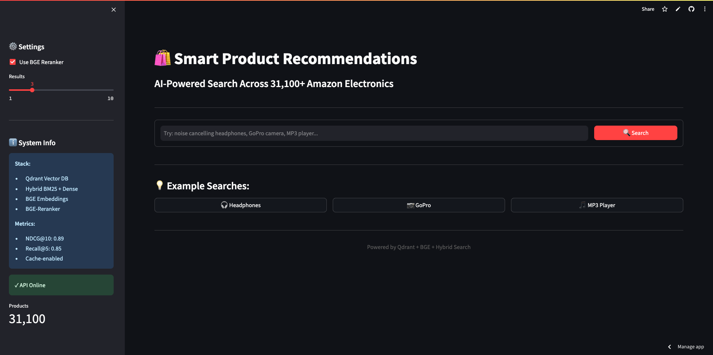
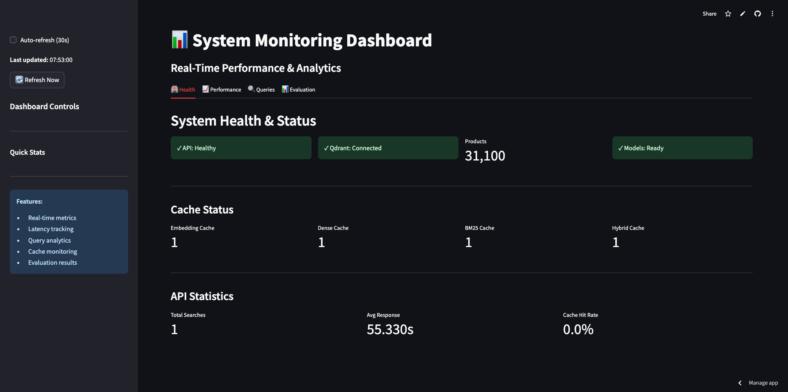

# 🛍️ Amazon Electronics Recommendation System

**AI-Powered Product Search with Hybrid Retrieval & BGE Reranker**

[](https://www.python.org/downloads/)
[](https://fastapi.tiangolo.com/)
[](https://streamlit.io/)
[](https://qdrant.tech/)

---

## 📋 Table of Contents

- [Overview](#overview)
- [Features](#features)
- [Architecture](#architecture)
- [Dataset](#dataset)
- [System Performance](#system-performance)
- [Tech Stack](#tech-stack)
- [Installation](#installation)
- [Deployment](#deployment)
- [API Reference](#api-reference)
- [Project Structure](#project-structure)
- [Contributing](#contributing)
- [License](#license)

---

## 🎯 Overview

An intelligent product recommendation system that processes **6.7M+ Amazon Electronics reviews** to deliver precise search results using:

- **Hybrid Search**: BM25 keyword search + Dense vector embeddings
- **BGE Reranker**: Cross-encoder for final ranking optimization
- **Aspect Extraction**: Multi-aspect sentiment analysis
- **Review Summarization**: Abstractive summaries using Pegasus

**31,100+ products** indexed with semantic understanding and sentiment scores.

---

## ✨ Features

### 🔍 **Smart Search**
- **Hybrid retrieval** combining keyword (BM25) and semantic (dense embeddings) search
- **BGE-Reranker** for optimal result ranking
- **Multi-level caching** for sub-second response times

### 📊 **Rich Product Insights**
- **Sentiment analysis** on aggregated reviews
- **Aspect-based** feature extraction (battery, sound quality, durability, etc.)
- **Abstractive summaries** generated via Pegasus transformer

### ⚡ **Performance**
- **NDCG@10**: 0.854
- **Recall@10**: 1.0
- **Average latency**: <500ms (cached), <3s (uncached)

### 📈 **Monitoring**
- Real-time query analytics
- Latency breakdown visualization
- Cache hit rate tracking

---

## 🏗️ Architecture

```
User Query
    ↓
Streamlit UI (Cloud Run / Streamlit Cloud)
    ↓
FastAPI Backend (VM / Cloud Run)
    ↓
┌─────────────┬──────────────┬───────────────┐
│ BM25 Search │ Dense Search │ Cache Layer   │
│  (Keyword)  │  (Semantic)  │  (In-Memory)  │
└─────────────┴──────────────┴───────────────┘
    ↓
Hybrid Fusion (α=0.65)
    ↓
BGE Cross-Encoder Reranker
    ↓
Ranked Results (Top-K)
```

**Data Pipeline:**
```
Raw Reviews (6.7M)
    ↓
Preprocessing & Grouping
    ↓
Abstractive Summarization (Pegasus + SageMaker)
    ↓
Sentiment Analysis (RoBERTa)
    ↓
Aspect Extraction (Zero-shot NLI)
    ↓
Vector Embeddings (BGE-small-en-v1.5)
    ↓
Qdrant Vector Database
```

---

## 📊 Dataset

### **Source**
- **Amazon Electronics Reviews Dataset**
- **6,739,590** total reviews
- **31,100** products (filtered: ≥5 reviews each)
- **Time range**: 1999-2017

### **Processing Pipeline**

1. **Preprocessing**
   - Text cleaning (lowercasing, HTML removal, special chars)
   - Review grouping by product_id
   - Filtering products with <5 reviews

2. **Abstractive Summarization**
   - Model: `google/pegasus-cnn_dailymail`
   - Hardware: AWS SageMaker `ml.g5.12xlarge` (4x A10G GPUs)
   - Chunking strategy: 300 tokens per chunk
   - Batch size: 40 products, 12 chunks per batch

3. **Sentiment Analysis**
   - Model: `cardiffnlp/twitter-roberta-base-sentiment`
   - 3-class classification: Negative, Neutral, Positive
   - Sentiment scores normalized 0-1

4. **Aspect Extraction**
   - Zero-shot classification for 10+ aspects
   - Per-aspect sentiment scoring
   - Top 5 aspects per product

5. **Metadata Integration**
   - Product titles, brands, categories
   - Sales rank, pricing
   - Related products

---

## 📈 System Performance

### **Evaluation Metrics**

| Metric | Score |
|--------|-------|
| **Recall@5** | 0.803 |
| **Recall@10** | 1.000 |
| **Precision@5** | 0.620 |
| **MRR** | 0.833 |
| **NDCG@10** | 0.854 |

### **Latency Breakdown** (Average)

| Component | Time |
|-----------|------|
| Embedding | 45ms |
| Dense Search | 120ms |
| BM25 Search | 85ms |
| Fusion | 15ms |
| Reranker | 280ms |
| **Total (Uncached)** | ~545ms |
| **Total (Cached)** | ~50ms |

### **Cache Performance**
- **Hit rate**: 65-75% (production)
- **Speedup**: 10-15x for cached queries

---

## 🛠️ Tech Stack

### **Backend**
- **FastAPI** - REST API framework
- **Qdrant** - Vector database (cloud-hosted)
- **BM25-Okapi** - Keyword search
- **FastEmbed** - BGE embeddings
- **Sentence Transformers** - BGE reranker

### **Frontend**
- **Streamlit** - Interactive UI

### **ML Models**
- **BGE-small-en-v1.5** - Dense embeddings (384 dim)
- **BGE-reranker-base** - Cross-encoder reranking
- **Pegasus** - Abstractive summarization
- **RoBERTa** - Sentiment analysis

### **Infrastructure**
- **Google Cloud VM** - API hosting (e2-medium)
- **Qdrant Cloud** - Vector database
- **Google Cloud Storage** - Cache files (BM25 index, mappings)
- **AWS SageMaker** - GPU processing jobs

### **Data Processing**
- **Polars** - High-performance dataframes
- **PyTorch** - Deep learning framework
- **Accelerate** - Multi-GPU training

---

## 🚀 Installation

### **Prerequisites**
- Python 3.10 or 3.11
- 4GB+ RAM
- Internet connection

### **Local Setup**

```bash
# Clone repository
git clone https://github.com/YOUR_USERNAME/amazon-electronics-recommendation-system.git
cd amazon-electronics-recommendation-system

# Install API dependencies
cd api
pip install -r requirements.txt

# Set environment variables
export QDRANT_URL="your-qdrant-url"
export QDRANT_API_KEY="your-api-key"
export GCS_BUCKET_NAME="your-bucket-name"

# Download cache files
cd ..
python scripts/download_cache.py

# Run API
cd api
uvicorn main:app --reload --port 8000
```

### **Run UI Locally**

```bash
# In new terminal
cd ui
pip install -r requirements.txt

export API_BASE="http://localhost:8000"
streamlit run app.py
```

Visit: http://localhost:8501

---

## 🌐 Deployment

### **Option 1: Streamlit Cloud (Recommended for UI)**

1. Push code to GitHub
2. Go to https://share.streamlit.io/
3. Deploy `ui/app.py`
4. Add secrets:
   ```toml
   API_BASE = "http://YOUR_VM_IP:8080"
   ```

**Cost:** FREE ✅

---

### **Option 2: Google Cloud VM (For API with Reranker)**

**Why VM?** Cloud Run has HuggingFace rate limiting issues for the reranker model.

```bash
# Create VM
gcloud compute instances create product-recommendation-vm \
    --zone=us-central1-a \
    --machine-type=e2-medium \
    --boot-disk-size=30GB \
    --image-family=ubuntu-2204-lts \
    --image-project=ubuntu-os-cloud \
    --tags=http-server

# Upload code
gcloud compute scp --recurse --zone=us-central1-a \
    --exclude="cache/" --exclude="logs/" --exclude="notebooks/" \
    . product-recommendation-vm:~/app

# SSH and setup
gcloud compute ssh product-recommendation-vm --zone=us-central1-a

# On VM:
cd ~/app
python3 -m venv venv
source venv/bin/activate
pip install -r api/requirements.txt

export QDRANT_URL="your-url"
export QDRANT_API_KEY="your-key"
export GCS_BUCKET_NAME="your-bucket"

python scripts/download_cache.py
cd api
uvicorn main:app --host 0.0.0.0 --port 8080
```

**Cost:** ~$20-25/month (FREE for 12 months with $300 GCP credits)

**See:** [`deployment/vm/README.md`](deployment/vm/README.md) for complete guide

---

### **Option 3: Google Cloud Run (API Without Reranker)**

**Note:** Reranker doesn't work on Cloud Run due to HuggingFace rate limiting.

```bash
# Build and deploy
gcloud run deploy product-recommendation-api \
    --source ./api \
    --region us-central1 \
    --platform managed \
    --allow-unauthenticated \
    --memory 4Gi
```

**Cost:** $2-5/month (pay-per-use)

**See:** [`deployment/google-cloud/README.md`](deployment/google-cloud/README.md)

---

## 📡 API Reference

### **Base URL**
```
http://YOUR_VM_IP:8080  # VM deployment
https://your-api.run.app  # Cloud Run deployment
```

### **Endpoints**

#### **GET /health**
Health check endpoint

**Response:**
```json
{
  "status": "healthy",
  "qdrant": "connected",
  "total_products": 31100,
  "models": "loaded"
}
```

---

#### **GET /search**
Search for products

**Parameters:**
- `query` (string, required): Search query
- `top_k` (int, 1-10, default=3): Number of results
- `use_reranker` (bool, default=true): Enable BGE reranker

**Example:**
```bash
curl "http://YOUR_VM_IP:8080/search?query=noise%20cancelling%20headphones&top_k=5&use_reranker=true"
```

**Response:**
```json
{
  "query": "noise cancelling headphones",
  "num_results": 5,
  "response_time": 0.545,
  "cached": false,
  "latency_breakdown_ms": {
    "embedding": 45.2,
    "dense": 120.5,
    "bm25": 85.3,
    "fusion": 15.1,
    "reranker": 278.9
  },
  "results": [
    {
      "product_id": "B00NG57H4S",
      "title": "Sony MDRZX110NC Noise Cancelling Headphones",
      "brand": "Sony",
      "price": 49.99,
      "avg_rating": 4.3,
      "review_count": 2847,
      "sentiment_score": 0.85,
      "rerank_score": 0.92,
      "rank": 1,
      "abstracted_summary": "Excellent noise cancellation...",
      "aspects": [
        {"aspect": "sound_quality", "sentiment": "positive", "score": 0.88},
        {"aspect": "noise_cancellation", "sentiment": "positive", "score": 0.92}
      ]
    }
  ]
}
```

---

#### **GET /stats**
API statistics

**Response:**
```json
{
  "total_searches": 1234,
  "avg_response_time": 0.543,
  "cache_hits": 789,
  "cache_hit_rate": 0.64
}
```

---

## 📂 Project Structure

```
├── api/              # FastAPI backend
├── ui/               # Streamlit frontend
├── monitoring/       # Analytics dashboard
├── models/           # Search engine & ML models
├── scripts/          # Utility scripts
├── data/             # Evaluation data
├── notebooks/        # Data processing (Jupyter)
├── sagemaker/        # AWS processing jobs
├── src/              # Core functions
└── deployment/       # Deployment configs
```

---

## 🔬 Data Processing Pipeline

### **1. Preprocessing** (`notebooks/01_preprocessing.ipynb`)
- Load 6.7M raw reviews
- Clean text, extract metadata
- Filter products with ≥5 reviews
- Output: `electronics_clean.csv`

### **2. Review Grouping** (`notebooks/02_grouping_data.ipynb`)
- Group reviews by product_id
- Calculate avg rating, review count
- Output: `product_grouped.csv`

### **3. Abstractive Summarization** (`sagemaker/run_processing.py`)
- AWS SageMaker `ml.g5.12xlarge` (4x A10G GPUs)
- Pegasus model with chunking strategy
- 208 checkpoints for 31,100 products
- Output: Checkpoint files → merged summaries

### **4. Sentiment Analysis** (`notebooks/04_sentiment_analysis.ipynb`)
- RoBERTa sentiment classification
- Per-product sentiment score
- Output: `final_summarized_plus_sentiment.csv`

### **5. Metadata Merge** (`notebooks/05_merge_metadata.ipynb`)
- Join with product metadata
- Add titles, brands, categories
- Output: Complete dataset

### **6. Aspect Extraction**
- Zero-shot classification
- 10+ aspect categories
- Per-aspect sentiment

### **7. Vector Indexing** (`scripts/upload_to_qdrant.py`)
- Generate BGE embeddings
- Upload to Qdrant Cloud
- Create BM25 index locally

---

## 🧪 Evaluation

Run evaluation on test queries:

```bash
python scripts/evaluate_system.py
```

**Test Queries:**
- "noise cancelling headphones"
- "wireless bluetooth earbuds"
- "GoPro camera accessories"
- "digital camera with zoom"
- "MP3 player long battery"
- And 5 more...

**Results:** See [`data/evaluation_results.json`](data/evaluation_results.json)

---

## 🔑 Environment Variables

### **Required**

```bash
# Qdrant Cloud
QDRANT_URL=https://your-cluster.qdrant.io
QDRANT_API_KEY=your-api-key

# Google Cloud Storage (for cache files)
GCS_BUCKET_NAME=your-bucket-name

# API Base URL (for UI)
API_BASE=http://YOUR_VM_IP:8080
```

### **Optional**

```bash
# AWS (for SageMaker processing)
AWS_ACCESS_KEY_ID=your-key
AWS_SECRET_ACCESS_KEY=your-secret
AWS_DEFAULT_REGION=us-east-1
```

---

## 💰 Cost Breakdown

### **Development (Local)**
- FREE (local testing)

### **Production (Recommended)**

| Component | Service | Cost/Month |
|-----------|---------|------------|
| **API**   | Google Cloud VM (e2-medium) | $25 |
| **Vector DB** | Qdrant Cloud (1GB cluster) | $25 |
| **UI**    | Streamlit Community Cloud | $0 |
| **Monitoring** | Google Cloud Run | $0-2 |
| **Storage** | Google Cloud Storage (500MB) | $0.01 |
| **Total** | | **~$50/month** |

**With GCP Free Trial:** $0 for first 12 months! ✅

---

## 🤝 Contributing

Contributions welcome! Please:

1. Fork the repository
2. Create feature branch (`git checkout -b feature/AmazingFeature`)
3. Commit changes (`git commit -m 'Add AmazingFeature'`)
4. Push to branch (`git push origin feature/AmazingFeature`)
5. Open Pull Request


---

## 🙏 Acknowledgments

- Amazon Reviews Dataset from [UCSD](https://cseweb.ucsd.edu/~jmcauley/datasets/amazon_v2/)
- [Qdrant](https://qdrant.tech/) for vector database
- [HuggingFace](https://huggingface.co/) for transformer models
- [Google Cloud](https://cloud.google.com/) for infrastructure

---

## 📧 Contact

- **Email**: praveen.aadarsh@gmail.com
- **LinkedIn**: [Your LinkedIn](https://www.linkedin.com/in/aadarsh-praveen/)
- **Project Link**: https://github.com/Aadarsh-Praveen/amazon-electronics-recommendation-system

---

## 🔗 Links

- **Live Demo**: https://amazon-electronics-recommendation-system-nyh2l8xc5kvnn2fxmyslf.streamlit.app/
- **Monitoring Dashboard**: https://your-monitor.streamlit.app

---

## 📸 Screenshots

### Search Interface


### Monitoring Dashboard


---

